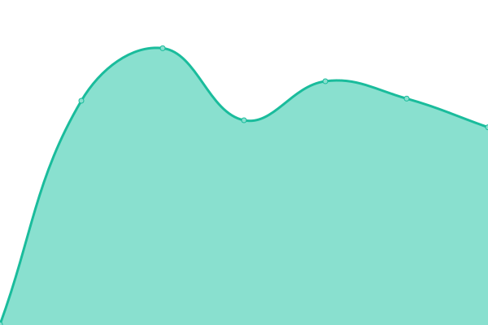
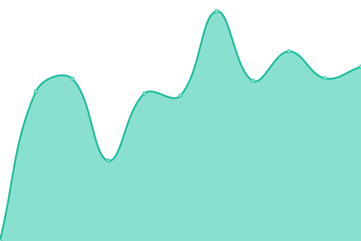

## 📈 Live Status: <!--live status--> **🟩 All systems operational**

<!--start: status pages-->
<!-- This summary is generated by Upptime (https://github.com/upptime/upptime) -->
<!-- Do not edit this manually, your changes will be overwritten -->

| URL                                                             | Status | History                                                                                            | Response Time                                                                       | Uptime                                                                                                                                                                                                                   |
| --------------------------------------------------------------- | ------ | -------------------------------------------------------------------------------------------------- | ----------------------------------------------------------------------------------- | ------------------------------------------------------------------------------------------------------------------------------------------------------------------------------------------------------------------------ |
| [Sydney](https://prod01.sydney.platformos.com/_status)          | 🟩 Up  | [sydney.yml](https://github.com/mdyd-dev/uptime/commits/master/history/sydney.yml)                 |  1782ms        |                  |
| [Oregon](https://prod01.oregon.platform-os.com/_status)         | 🟩 Up  | [oregon.yml](https://github.com/mdyd-dev/uptime/commits/master/history/oregon.yml)                 |  665ms         |                  |
| [London](https://prod01.london.platform-os.com/_status)         | 🟩 Up  | [london.yml](https://github.com/mdyd-dev/uptime/commits/master/history/london.yml)                 |  378ms         |                  |
| [Oregon Staging](https://staging.oregon.platformos.com/_status) | 🟩 Up  | [oregon-staging.yml](https://github.com/mdyd-dev/uptime/commits/master/history/oregon-staging.yml) |  434ms |  |
| [Partner Portal](https://partners.platformos.com/)              | 🟩 Up  | [partner-portal.yml](https://github.com/mdyd-dev/uptime/commits/master/history/partner-portal.yml) |  450ms |  |

<!--end: status pages-->
