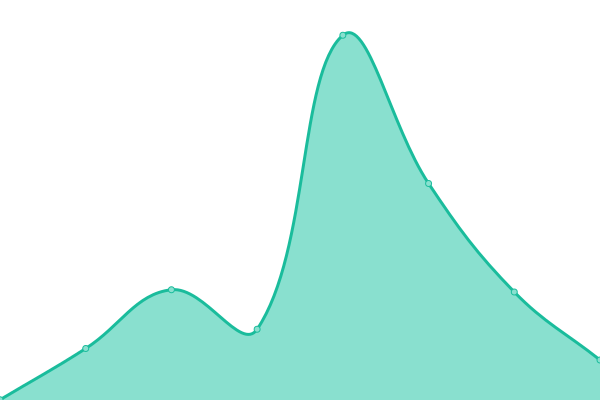

## 📈 Live Status: <!--live status--> **🟧 Partial outage**

<!--start: status pages-->
<!-- This summary is generated by Upptime (https://github.com/upptime/upptime) -->
<!-- Do not edit this manually, your changes will be overwritten -->
<!-- prettier-ignore -->
| URL | Status | History | Response Time | Uptime |
| --- | ------ | ------- | ------------- | ------ |
|  [Sydney](https://prod01.sydney.platformos.com/_status) | 🟩 Up | [sydney.yml](https://github.com/mdyd-dev/uptime/commits/HEAD/history/sydney.yml) | 

 850ms
     
 | 

<a href="https://mdyd-dev.github.io/uptime/history/sydney">99.85%</a>
    

|  [Oregon](https://prod01.oregon.platform-os.com/_status) | 🟥 Down | [oregon.yml](https://github.com/mdyd-dev/uptime/commits/HEAD/history/oregon.yml) | 

 1797ms
     
 | 

<a href="https://mdyd-dev.github.io/uptime/history/oregon">100.00%</a>
    

|  [London](https://prod01.london.platform-os.com/_status) | 🟩 Up | [london.yml](https://github.com/mdyd-dev/uptime/commits/HEAD/history/london.yml) | 

 462ms
     
 | 

<a href="https://mdyd-dev.github.io/uptime/history/london">100.00%</a>
    

|  [Oregon Staging](https://staging.oregon.platformos.com/_status) | 🟩 Up | [oregon-staging.yml](https://github.com/mdyd-dev/uptime/commits/HEAD/history/oregon-staging.yml) | 

 468ms
     
 | 

<a href="https://mdyd-dev.github.io/uptime/history/oregon-staging">100.00%</a>
    

|  [Partner Portal](https://partners.platformos.com/) | 🟩 Up | [partner-portal.yml](https://github.com/mdyd-dev/uptime/commits/HEAD/history/partner-portal.yml) | 

 461ms
     
 | 

<a href="https://mdyd-dev.github.io/uptime/history/partner-portal">100.00%</a>
    

<!--end: status pages-->
